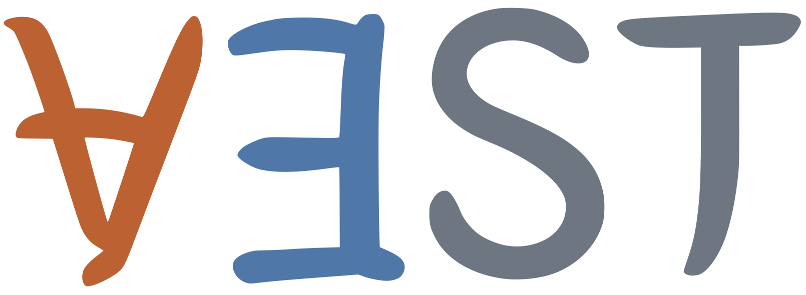
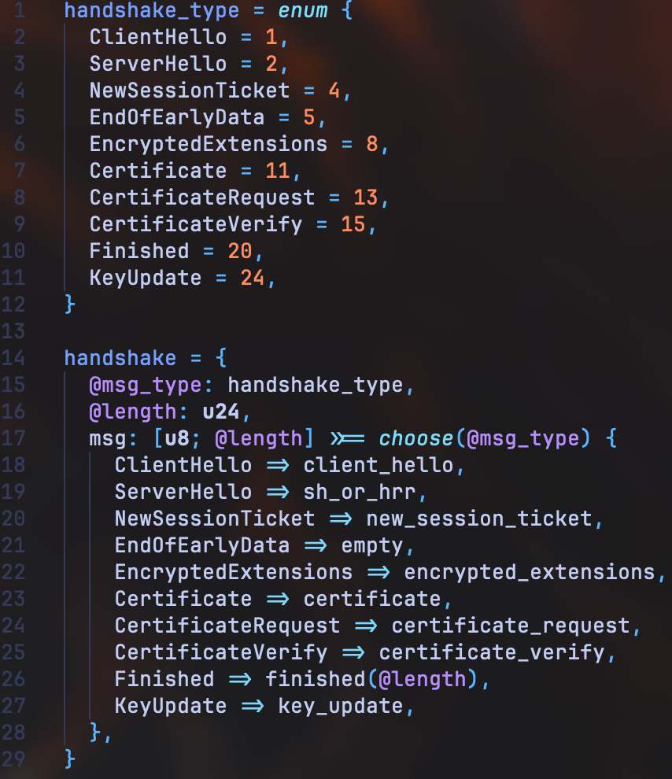

[](https://github.com/secure-foundations/vest/actions/workflows/ci.yml)
[](https://secure-foundations.github.io/vest/guide/)
[](https://secure-foundations.github.io/vest/vest_lib/)
[](https://crates.io/crates/vest)
[](https://crates.io/crates/vest_lib)
[](https://verus-lang.zulipchat.com/)

# 

Vest is a framework based on [Verus](https://github.com/verus-lang/verus) for building verified, secure, performant binary parsers and serializers in Rust.
It consists of several core components:
* `vest_lib`, a verified combinator library for building formats compositionally.
* `vest` DSL, a domain-specific language for describing formats concisely; and a compiler that automatically generates verified Rust code (leveraging the combinator library `vest_lib`) from format descriptions in the DSL.
* `vest_asn1`, a compiler for ASN.1 schemas that automatically generates verified parsers and serializers (leveraging the verified backend ASN.1 combinators in `vest_lib`), supporting both Distinguished Encoding Rules (DER) and Basic Encoding Rules (BER).
* Vest-CBOR, a verified generic CBOR codec (built on top of `vest_lib` combinators) that supports both general and deterministic CBOR.

Vest-generated parsers and serializers are provably memory-safe, arithmetically safe, panic-free, and terminating on any input. 
More importantly, they are guaranteed to satisfy a suite of *security properties*, making them immune to entire classes of attacks that historically plague unverified, hand-written code.

<p align="center">
  
</p>

## Status

Vest is a research tool under active development. The DSL and ASN.1 frontend are *not* by themselves verified and could contain bugs. Some language and format features are still unsupported, and APIs may change. The [language reference](https://secure-foundations.github.io/vest/guide/dsl/reference.html) and [ASN.1 support table](https://secure-foundations.github.io/vest/guide/asn1/support.html) document current limitations. Each Vest release pins the compatible [Verus version](verus-version.txt).

## Documentation

- The [Vest guide](https://secure-foundations.github.io/vest/guide/) covers installation, the DSL, generated Rust APIs, formal guarantees, and the ASN.1 frontend.
- The [`vest_lib` documentation](https://secure-foundations.github.io/vest/vest_lib/) describes the nitty-gritty (spec, proof, and exec) of Vest's trait system, format combinators, the reasoning principles, etc.

## Examples of using Vest

- Vest DSL examples include [TLS](vest_tests/src/tls.vest), [Bitcoin](vest_tests/src/bitcoin.vest), [WireGuard](vest_tests/src/wireguard.vest), and smaller ones covering [bit fields](vest_tests/src/bits.vest), [dependent choices and TLV](vest_tests/src/tlv.vest), and [nested structures](vest_tests/src/nested_access.vest).
- The ASN.1 frontend includes a [curated CMS schema](vest_asn1/rfcs/CMS-RFC5652-Curated.asn1), alongside smaller [DER](vest_asn1_tests/fixture.asn1), [BER](vest_asn1_tests/fixture_ber.asn1), and [mixed-rule](vest_asn1_tests/fixture_mixed.asn1) schemas.
- [`vest_dev/src/formats`](vest_dev/src/formats) contains example formats written directly with `vest_lib` combinators, including [mapped formats](vest_dev/src/formats/mapped.rs), [dependent formats](vest_dev/src/formats/dependent.rs), and [recursive formats](vest_dev/src/formats/fix.rs).

## Getting in touch and reporting issues

Please report `vest_lib` issues and DSL/ASN.1 compiler bugs through [GitHub Issues](https://github.com/secure-foundations/vest/issues). For questions, help, or design discussions, join the [Verus Zulip](https://verus-lang.zulipchat.com/) and mention **Vest** in the topic or message.

## Publication

Vest was introduced in [“Vest: Verified, Secure, High-Performance Parsing and Serialization for Rust”](https://tracycy.com/papers/vest-usenix-security25.pdf) at the 2025 USENIX Security Symposium.

```bibtex
@inproceedings {vest,
	author = {Yi Cai and Pratap Singh and Zhengyao Lin and Jay Bosamiya and Joshua Gancher and Milijana Surbatovich and Bryan Parno},
	title = {{Vest}: Verified, Secure, {High-Performance} Parsing and Serialization for Rust},
	booktitle = {34th USENIX Security Symposium (USENIX Security 25)},
	year = {2025},
	isbn = {978-1-939133-52-6},
	address = {Seattle, WA},
	pages = {6917--6935},
	url = {https://www.usenix.org/conference/usenixsecurity25/presentation/cai-yi},
	publisher = {USENIX Association},
	month = aug
}
```

Vest is available under the [MIT License](LICENSE).
