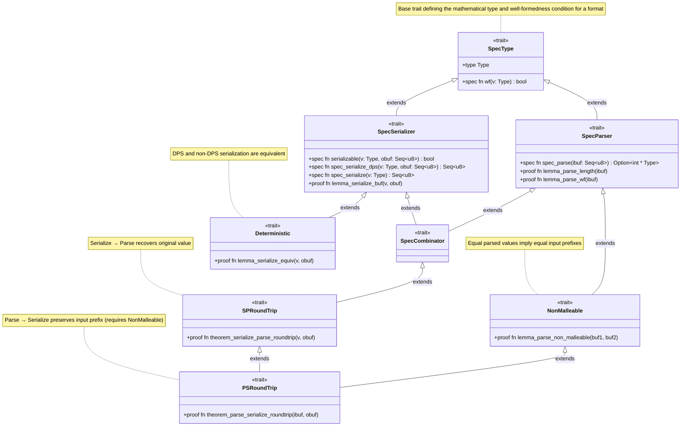

# New Design for `VestLib`

## Motivation

The current design of `VestLib` has several limitations that hinder its
usability and expressivity. The main issues include:

- **Limited Composability**:
  - To *sequentially compose* two combinators, the
    first must satisfy the `prefix_secure` property (no lookahead). This prevents
    the composition of, for example, two optional (say `Opt<A>` and `Opt<B>`)
    combinators, as `Opt<T>` is not `prefix_secure`. However, it can be proved
    that it is still secure to sequentially compose `Opt<A>` and `Opt<B>`, as
    long as `A` and `B` are "disjoint" (i.e., they cannot both succeed on the
    same input).
    - Concretely, the following format is not supported by Vest even though it is secure:
      ```vest
      opts = {
        a: Opt<wrap(u8 = 0x00, fmt0)>,
        b: Opt<wrap(u8 = 0x01, fmt1)>,
        c: Opt<wrap(u8 = 0x02, fmt2)>,
      }
      ```
  - To *alternatively compose* two combinators (using ordered choice), the
    two combinators must be "disjoint". We proved generically via traits that
    two combinators of *the same type* (e.g., `Pair<A, B>` and `Pair<C, D>` are
    disjoint given some conditions, thus allowing the composition of choice of
    combinators of the same type, as well as nested choices. However,
    the composition of choice of combinators of *different types* (e.g.,
    `Choice<Pair<A, B>, Tag<C>`), albeit secure, is not possible. Moreover,
    ordered choice in the original PEG semantics allows choices that are not
    disjoint (whether that's helpful or causing more confusion is another
    question), but the current design precludes that possibility.
    - Concretely, `alt1` is supported by Vest:
      ```vest
      alt1 = choose {
        A(<wrap(u8 = 0x00, fmt0)>),
        B(<wrap(u8 = 0x01, fmt1)>),
        C(<wrap(u8 = 0x02, fmt2)>),
      }
      ```
      But `alt2` and `alt3` are not, even if they are secure:
      ```vest
      const TAG_A: u8 = 0x00

      alt2 = choose {
        A(TAG_A),
        B(<wrap(u8 = 0x01, fmt1)>),
        C(<wrap(u8 = 0x02, fmt2)>),
      }

      alt3 = choose {
        A(TAG_A),
        Other(fmt3),
      }

      fmt3 = {
        @tag: u8 | 1..u8::MAX,
        val: choose(@tag) {
        ...
        }
      }
      ```
- **Limited Expressivity**:
  - The current combinator design does not allow constructing *recursive*
    combinators. This is partly due to the limitations of Verus --- it precludes
    cyclic trait implementations altogether (to conservatively prove
    termination); and partly due to the current interface not providing any
    metric to bound the recursion depth.
    - For example, a well-bracketed expression is not supported:
      ```vest
      bracket_expr = choose {
        Bracket(wrap(u8 = '[', bracket_expr, u8 = ']')),
        Just(expr),
      }
      expr = ...
      ```
  - The current combinator design does not allow constructing parsers and
    serializers for *malleable* formats, i.e., formats that allow multiple valid
    serialized representations for the same value (e.g., comments and whitespaces
    in JSON/XML, non-canonical encodings in ASN.1 BER, Protobuf etc.). The
    current design enforces a *strict*, *bi-directional* round-trip property
    between parsing and serialization, which is not achievable for malleable
    formats.
    > What if our guarantee says: the malleability of the provided format 
    > (and the generated parser) can *only* stem from the malleable sub-format?
  - We only support left-to-right (forward) data-dependency; formats like zip/parquet 
    need right-to-left (backward) data-dependency.
  - We don't have semantic actions/parsing states.
    - How to support it while keeping the roundtrip of *parse-serialize*?
  - We don't support non-linear parsing ("pointer-chasing"), needed by 
    a lot of file formats
- **Limited Flexibility**:
  - Right now, we only produce *full parsers* on *read-only* inputs,
    but in some use cases, validators that don't collect and 
    in-place accessors/modifiers can provide more flexibility and control for users.
    The key challenge woule be supporting parsing on and into mutable data structures,
    as well as producing "lazy" values like iterators (as opposed to "eager" values like `Vec`).
  - Right now, we assume the input to be fully available and small enough to fit
    entirely in main memory, however, there could be more inputs available over the *time*, or they 
    could be too big in *space* to fit into memory. Supporting streamming parsers would provide
    more flexibility for incremental processing.
- **Usability/Readability Issues**:
  - The current combinator design leverages traits when possible to unify the
    spec and exec implementations. However, this leads to a lot of
    boilerplate code (e.g., `impl Pred for F` when a closure suffices) and make
    directly using/reading the combinators unintuitive/cumbersome.

## Failed Attempts

One can imagine implementing a specialized combinator for sequentially composing
optional combinators.

- `OptThen<A, B>(Opt<A>, B)` where `A` is `prefix_secure` and `B` is disjoint
  with `A`. This would allow composing a sequence of optional combinators, e.g.,
  `OptThen<Opt<A>, OptThen<Opt<B>, OptThen<Opt<C>, D>>>`. However, note that `D`
  must be disjoint with `C`, and hence cannot be an `Opt<D'>` (two optional
  combinators always overlap on the empty input). Thus, this does not completely
  solve the problem of composing multiple optional combinators.
- `ThenOpt<A, B>(A, Opt<B>)` will fail even more obviously, as `A` cannot be an
  `Opt<A'>` (`Opt<T>` is not `prefix_secure` for any `T`, thus
  `theorem_serialize_parse_roundtrip` cannot be proved).
- `PairOpt<A, B>(Opt<A>, Opt<B>)` can be proved for both round-trip theorems if
  `A` and `B` are disjoint, but it is clearly not as compositional --- one would
  have to manually prove for `TripleOpt<A, B, C>(Opt<A>, PairOpt<Opt<B>, Opt<C>>)`
  and so on.

One could imagine assembling disjointness proofs at code-generation time.
However, it is not clear how to do this in a fully generic way, without hitting
the famous "conflicting trait implementations" problem in Rust.

As stated above, using "lazy combinators" (thunks) to achieve recursion is not
possible in Verus, as it creates cyclic trait implementations.

## Insights

### Insights on Composability

Prefix-security, disjointness, productivity, etc. are all useful properties to
have, but they are not necessary (though sufficient) conditions for secure
composition of combinators.

Specifically, to prove `theorem_serialize_parse_roundtrip`, we currently imposed

- `prefix_secure` on `A` in `Pair<A, B>`
- `disjoint_from(A)` on `B` in `Choice<A, B>`
- `productive` on `A` in `Opt<A>`

However, if we squint our eyes a little on the proofs, what we really need is:

1. Facts about `A`'s parsing behavior *in the presence of* the serialized output of
  `B` in `Pair<A, B>`
2. Facts about `A`'s parsing behavior *on* the serialized output of `B` in `Choice<A, B>`
3. Facts about `A`'s parsing behavior when `Opt<A>` serializes a `None` value

For 1, we can generalize `theorem_serialize_parse_roundtrip` to take a
"destination buffer" and make `spec_serialize` "destination-passing style"
(DPS); for 2 and 3, we can impose a "serializable" condition that expresses the
*exact* composability requirement on the input value and the destination buffer.

### Insights on Expressivity

TODO.

### Insights on Usability/Readability

TODO.

## New Serializer Spec Design

We make `spec_serialize` destination-passing style (DPS), i.e., it takes an
additional argument `obuf: Seq<u8>` and *prepends* the serialized output to
`obuf`.

```diff
-    fn spec_serialize(&self, v: Self::Type) -> Seq<u8>;
+    fn spec_serialize(&self, v: Self::Type, obuf: Seq<u8>) -> Seq<u8>;
```

We modify the round-trip theorems accordingly.

```diff
-    proof fn theorem_serialize_parse_roundtrip(&self, v: Self::Type)
-        requires
-            self.requires(),
-        ensures
-            self.wf(v) ==> self.spec_parse(self.spec_serialize(v)) == Some(
-                (self.spec_serialize(v).len() as int, v),
-            ),
-    ;
+    proof fn theorem_serialize_parse_roundtrip(&self, v: Self::Type, obuf: Seq<u8>)
+        requires
+            self.serializable(v, obuf),
+        ensures
+            self.wf(v) ==> self.spec_parse(self.spec_serialize(v, obuf)) == Some(
+                (self.spec_serialize(v, obuf).len() - obuf.len(), v),
+            ),
+    ;
-    proof fn theorem_parse_serialize_roundtrip(&self, buf: Seq<u8>)
-        requires
-            self.requires(),
-        ensures
-            self.spec_parse(buf) matches Some((n, v)) ==> {
-                &&& self.wf(v)
-                &&& self.spec_serialize(v) == buf.take(n)
-            },
-    ;
+    proof fn theorem_parse_serialize_roundtrip(&self, ibuf: Seq<u8>, obuf: Seq<u8>)
+        ensures
+            self.spec_parse(ibuf) matches Some((n, v)) ==> {
+                &&& self.wf(v)
+                &&& self.spec_serialize(v, obuf) == ibuf.take(n) + obuf
+            },
+    ;
```

This way, serialization happens "backwards" or "right-to-left", and
hence the serialized output of `B` in `Pair<A, B>` is passed as the destination
buffer to `A` (`A.spec_serialize(v.0, B.spec_serialize(v.1, obuf))`), allowing us to prove the round-trip theorem without requiring
`prefix_secure` on `A` (as we can invoke exactly
`A.theorem_serialize_parse_roundtrip(v.0, B.spec_serialize(v.1, obuf))` for induction).

> NOTE: Serialization needs to happen in reverse order for
> `theorem_serialize_parse_roundtrip` to hold. For example, for fixed-length bytes combinator
> `Fixed::<N>`, if we serialize in left-to-right order (`Fixed::<N>.spec_serialize(b, obuf) = obuf + b`),
> then the corresponding parser would need to parse from the end of the input buffer, which is not possible
> in the current design.

We introduce a new lemma to relate the return value of `spec_serialize` to the destination
buffer `obuf`, which is used in the proof of `theorem_serialize_parse_roundtrip`.

```rust
proof fn lemma_serialize_buf(&self, v: Self::Type, obuf: Seq<u8>)
    requires
        self.requires(v, obuf),
    ensures
        self.wf(v) ==> exists|new_buf: Seq<u8>| self.spec_serialize(v, obuf) == new_buf + obuf,
;
```

We introduce a new predicate `serializable(v, obuf)` to express the composability
requirement (for combinators to call `spec_serialize`) on the input value `v`
and the destination buffer `obuf`.

```rust
open spec fn serializable(&self, v: Self::Type, obuf: Seq<u8>) -> bool;
```

For example, for `Opt<A>`, we have 

```rust
open spec fn serializable(&self, v: Self::Type, obuf: Seq<u8>) -> bool {
    match v {
        None => self.0.spec_parse(obuf) is None, // <-- here
        Some(vv) => self.0.serializable(vv, obuf),
    }
}
```

i.e., if `Opt<A>` serializes a `None` value, then `A` must fail to parse
`obuf` (otherwise, `A` could have consumed part of `obuf` during parsing,
violating the round-trip property).

For `Choice<A, B>`, we have

```rust
open spec fn serializable(&self, v: Self::Type, obuf: Seq<u8>) -> bool {
    match v {
        Either::Left(va) => self.0.serializable(va, obuf),
        Either::Right(vb) => {
            &&& self.1.serializable(vb, obuf)
            &&& self.0.spec_parse(self.1.spec_serialize(vb, obuf)) is None // <-- here
        }
    }
}
```

i.e., if `Choice<A, B>` serializes a `Right(vb)` value, then `A` must fail to
parse the serialized output of `B` (otherwise, `A` could have consumed part of
`B`'s serialized output during parsing, violating the round-trip property).

For `Tail`, we have

```rust
open spec fn serializable(&self, v: Self::Type, obuf: Seq<u8>) -> bool {
    obuf.len() == 0
}
```

i.e., `Tail` can only be serialized when the destination buffer is empty
(otherwise, `Tail` parser could have consumed all of `obuf`, violating the
round-trip property).

Importantly, `serializable` conditions are *transitively* enforced during
composition of combinators. For example, in `Pair<A, B>`, we have

```rust
open spec fn serializable(&self, v: Self::Type, obuf: Seq<u8>) -> bool {
    &&& self.1.serializable(v.1, obuf)
    &&& self.0.serializable(v.0, self.1.spec_serialize(v.1, obuf))
}
```

> Unlike `prefix_secure`, `disjointness` or `productivity`, which were imposed
> on the composition of combinators, `serializable` conditions are only imposed
> during serialization. 

Now we can successfully compose the following combinators, none of which were
possible before:

```rust
// now we can sequentially compose multiple optional combinators!
let c0 = Pair(
          Pair(
            Opt(Tag(0x01)),
            Opt(Tag(0x02))),
            Opt(Tag(0x03))
          );
let v = ((Some(seq![0x01]), Some(seq![0x02])), Some(seq![0x03]));
let obuf = Seq::empty();
assert(c0.wf(v));
assert(c0.serializable(v, obuf));
c0.theorem_serialize_parse_roundtrip(v, obuf);
assert(c0.spec_parse(c0.spec_serialize(v, obuf)) == Some((3int, v)));

// we can even safely reuse tags, as long as reused tags are not adjacent!
let c1 = Pair(
          Pair(
            Opt(Tag(0x01)),
            Opt(Tag(0x02))),
            Opt(Tag(0x01)) // <-- note the reused tag
          );
let v = ((Some(seq![0x01]), None), Some(seq![0x01]));
let obuf = Seq::empty();
assert(c1.wf(v));
assert(c1.serializable(v, obuf));
c1.theorem_serialize_parse_roundtrip(v, obuf);
assert(c1.spec_parse(c1.spec_serialize(v, obuf)) == Some((2int, v)));

// to push the envelope further, we actually allow using the same tag consecutively!
let c1_ = Pair(
            Pair(
              Opt(Tag(0x01)),
              Opt(Tag(0x01))),
              Opt(Tag(0x01))
          );
let v_ok = ((Some(seq![0x01]), Some(seq![0x01])), Some(seq![0x01]));
let obuf = Seq::empty();
assert(c1_.wf(v_ok));
assert(c1_.serializable(v_ok, obuf)); // <-- (v_ok, obuf) is serializable because v_ok would serialize to [1, 1, 1], which would always be parsed back to `((Some([1]), Some([1])), Some([1]))`
let v_bad = ((Some(seq![0x01]), None), Some(seq![0x01]));
assert(c1_.wf(v_bad));
assert(!(c1_.serializable(v_bad, obuf))); // <-- (v_bad, obuf) is *not* serializable because v_bad would serialize to [1, 1], which would be parsed back to `((Some([1]), Some([1])), None)` instead of `((Some([1]), None), Some([1]))`

// we can even have non-disjoint choices, recovering PEG's original semantics!
let c2 = Choice(
          Choice(
            Tag(0x00),
            Tag(0x02)),
            Tag(0x02) // <-- note the non-disjoint choice arm
          );
let v1 = Either::Left(Either::Right(seq![2u8]));
let obuf = Seq::empty();
assert(c2.wf(v1));
assert(c2.serializable(v1, obuf)); // <-- (v1, obuf) is serializable because v1 would serialize to [2], which would always be parsed back to `Either::Left(Either::Right([2]))`
c2.theorem_serialize_parse_roundtrip(v1, obuf);
assert(c2.spec_parse(c2.spec_serialize(v1, obuf)) == Some((1int, v1)));

let v2 = Either::Right(seq![2u8]);
assert(c2.wf(v2));
assert(!(c2.serializable(v2, obuf))); // <-- (v2, obuf) is *not* serializable because v2 would serialize to [2], which can be parsed by the second choice arm, returning `Either::Left(Either::Right([2]))` instead of `Either::Right([2])`

// we can compose Tail safely!
let c = (Fixed::<2>, Tail);
let obuf = Seq::empty();
let v = (seq![1u8, 2u8], seq![3u8, 4u8, 5u8]);
assert(c.wf(v));
assert(c.requires(v, obuf));
let ibuf = c.spec_serialize(v, obuf);
c.theorem_serialize_parse_roundtrip(v, obuf);
assert(c.spec_parse(ibuf) == Some((5int, v)));

let obuf_bad = seq![0u8; 1];
assert(!c.requires(v, obuf_bad));

let c_bad = (Tail, Fixed::<3>);
assert(c_bad.wf(v));
assert(!c_bad.requires(v, obuf));
```

By introducing serializablility conditions and only imposing them during
serialization, Vest becomes significantly more expressive and composable, while
still safely rejecting ambiguous formats.

## New Trait System

The core of Vest++ is built upon a set of traits defining the parsing and
serialization specification for combinators, as well as the *stratified* correctness and security properties.

### Core Specification Traits

- **`SpecType`**: Defines the `Type` and a well-formedness predicate `wf(v)`.
- **`SpecParser`**: Defines `spec_parse` which attempts to consume bytes from an input buffer to produce a value.
- **`SpecSerializer`**: Defines `spec_serialize_dps` (Destination-Passing Style)
  which *prepends* the serialized value to an output buffer, as well as the
  traditional `spec_serialize` which produces a new byte sequence from a value.
  It also defines `serializable(v, obuf)` which expresses whether `v` can be
  serialized into the destination buffer `obuf`.
- **`SpecCombinator`**: A type that is both a parser and a serializer.

### Correctness and Security Property Traits

- **`SPRoundTrip: SpecCombinator` (Serialize-Parse)**: 
  `parse(serialize(v, obuf) == (v, ...)`
  Ensures that if you serialize a well-formed value, you can parse it back.

- **`NonMalleable: SpecParser`**:
  `parse(b1) == (v, n1) && parse(b2) == (v, n2) ==> b1[0..n1] == b2[0..n2]`
  Ensures that a single value has a unique binary representation.

- **`PSRoundTrip: SPRoundTrip + NonMalleable` (Parse-Serialize)**:
  `serialize(parse(b)?.v, ...) == b + ...`
  Ensures that if you parse bytes into a value, serializing it gives back the
  same bytes. This requires that the parser is `NonMalleable`.

- **`Deterministic: SpecSerializer`**:
  Ensures that the DPS serialization matches a direct serialization strategy
  (i.e., the serializer is deterministic as the strategy does not affect the
  serialized output). This would be useful for re-using existing proofs on
  exec-spec equivalence.
  
In other words, all Vest++ combinators can (and should) prove `SPRoundTrip`, but
only `NonMalleable` combinators can prove and hence enjoy the `PSRoundTrip` property.

### Hierarchy Diagram



### Malleable Combinators

Vest++ handles **malleable** formats (where multiple binary sequences map to the
same value, or equivalently, a parser loses information) explicitly.
A combinator is **malleable** if it does not satisfy the `NonMalleable` trait.

**Example: `BerBool` (Boolean values according to ASN.1 BER encoding)**

- Defined as a boolean where `false` is `0x00` and `true` is any non-zero byte.
- Parsing `0xFF` yields `true`. Serialization of `true` might choose `0x01` (arbitrary).
- Round-trip `0xFF` -> `true` -> `0x01` != `0xFF`. Fails `PSRoundTrip`.

**Example: `Preceded`, `Terminated` (Parsers with Potential Information Loss)**

Combinators like `Preceded<A, B>` (parse A, then B, return B) discard the value of A.

- To serialize the result (which is just B), `Preceded` must **invent** a witness for A.
- Uniqueness: Is the choice of witness unique?
  - If A has **`UniqueWfValue`** (e.g., `Tag`), there is only one valid choice.
    - `Preceded<Tag, B>` is `NonMalleable` and satisfies `PSRoundTrip`.
  - If A does not (e.g., `Fixed<N>`), the choice is arbitrary. 
    - `Preceded<Fixed<N>, B>` is malleable and fails `PSRoundTrip`.

In particular, if the user constructs a format containing malleable combinators, the
trait system will reflect that the overall format is malleable as well. If the
user attempts to use the combinator in a context that requires `NonMalleable`,
`rustc` will produce a very informative error message indicating which
combinator is malleable and why:

```rust
let format = Terminated(
        Preceded(
            Tag { inner: Fixed::<1>, tag: seq![0xAAu8] },
            ((BerBool, BerBool), Fixed::<2>)
        ),
        Tag { inner: Fixed::<1>, tag: seq![0xFFu8] }
    );
requires_non_malleable(format, seq![], seq![]); // Should fail: BerBool is malleable


proof fn requires_non_malleable<T: NonMalleable>(parser: T, buf1: Seq<u8>, buf2: Seq<u8>) {
    parser.lemma_parse_non_malleable(buf1, buf2);
}
```

```rust
error[E0277]: the trait bound `combinators::berbool::BerBool: core::proof::NonMalleable` is not satisfied
   --> src/tests/malleable.rs:184:28
    |
184 |     requires_non_malleable(format, header_val, footer_val); // Should fail: BerBool is malleable
    |     ---------------------- ^^^^^^ unsatisfied trait bound
    |     |
    |     required by a bound introduced by this call
    |
help: the trait `core::proof::NonMalleable` is not implemented for `combinators::berbool::BerBool`
   --> src/combinators/berbool/mod.rs:12:1
    |
 12 | pub struct BerBool;
    | ^^^^^^^^^^^^^^^^^^
    = help: the following other types implement trait `core::proof::NonMalleable`:
              (A, B)
              combinators::choice::Choice<A, B>
              combinators::fixed::Fixed<N>
              combinators::opt::Opt<A>
              combinators::preceded::Preceded<A, B>
              combinators::refined::Refined<A>
              combinators::refined::Tag<Inner>
              combinators::star::Star<A>
            and 2 others
note: required for `(combinators::berbool::BerBool, combinators::berbool::BerBool)` to implement `core::proof::NonMalleable`
   --> src/combinators/tuple/proof.rs:46:40
    |
 46 | impl<A: NonMalleable, B: NonMalleable> NonMalleable for (A, B) {
    |         ------------                   ^^^^^^^^^^^^     ^^^^^^
    |         |
    |         unsatisfied trait bound introduced here
    = note: 3 redundant requirements hidden
    = note: required for `Terminated<Preceded<Tag<Fixed<1>>, (..., ...)>, ...>` to implement `core::proof::NonMalleable`
note: required by a bound in `tests::malleable::requires_non_malleable`
   --> src/tests/malleable.rs:24:36
    |
 24 | proof fn requires_non_malleable<T: NonMalleable>(parser: T, buf1: Seq<u8>, buf2: Seq<u8>) {
    |                                    ^^^^^^^^^^^^ required by this bound in `requires_non_malleable`
```


See [`src/tests/malleable.rs`](src/tests/malleable.rs) for more examples.
